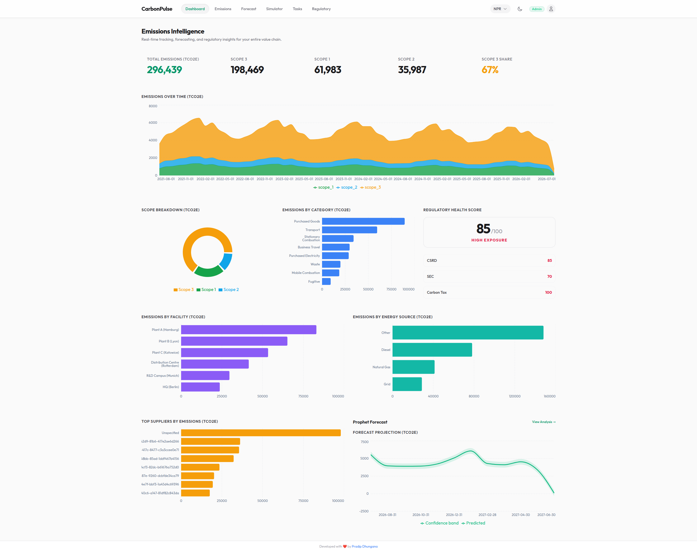

# CarbonPulse



CarbonPulse is an enterprise-grade carbon footprint intelligence platform. It is designed to help organisations track, forecast, and manage their greenhouse gas (GHG) emissions. 

It provides a live emissions dashboard (Scope 1, 2, 3), ML forecasting (12 months
ahead via Prophet), a real-time what-if simulator, and a regulatory risk scorer
(CSRD, SEC, carbon tax).

## Core capabilities (MVP)

- Live emissions dashboard with animated charts
- Prophet-based ML forecasting engine (12 months ahead)
- Real-time what-if simulator (slider-based parameter changes)
- Regulatory risk scoring
- Basic supply chain / supplier view

## Tech stack

- **Backend:** FastAPI, SQLAlchemy 2.0 (async), PostgreSQL, Redis, Alembic,
  Prophet, Pydantic v2
- **Frontend:** React 18 + TypeScript, Zustand, Recharts, Axios, Tailwind
- **Database:** PostgreSQL (TimescaleDB extension ready)
- **Auth:** JWT access + refresh tokens

## Repository structure

```
carbonpulse/
├── backend/          # FastAPI + SQLAlchemy 2.0 async
│   ├── app/
│   │   ├── api/v1/    # auth, emissions, forecast, simulator, regulatory, health
│   │   ├── core/      # config, logging, jwt, security, redis, rate limiting
│   │   ├── db/        # base, session, models, seed
│   │   ├── data/      # synthetic data generator
│   │   ├── schemas/   # Pydantic v2 schemas
│   │   └── services/  # business logic
│   ├── alembic/       # migrations
│   └── tests/         # unit + integration tests
├── frontend/          # React + TypeScript + Vite
├── data/synthetic/    # generated synthetic datasets
├── docker-compose.yml
├── docker-compose.dev.yml
└── README.md
```

## How to run

Prerequisites: Docker + Docker Compose.

```bash
cd carbonpulse
cp backend/.env.example backend/.env
cp frontend/.env.example frontend/.env
docker compose -f docker-compose.yml -f docker-compose.dev.yml up --build
```

Then apply migrations and seed demo data (in another terminal):

```bash
docker compose exec backend alembic upgrade head
docker compose exec backend python -m app.db.seed
```

Services:

- Backend (FastAPI): http://localhost:8000 — docs at http://localhost:8000/docs
- Frontend (Vite): http://localhost:5173
- PostgreSQL: localhost:5432
- Redis: localhost:6379

### Demo credentials

| Role    | Email                       | Password    |
|---------|-----------------------------|-------------|
| Admin   | admin@carbonpulse.dev       | admin123    |
| Analyst | analyst@carbonpulse.dev     | analyst123  |
| Viewer  | viewer@carbonpulse.dev      | viewer123   |

## API overview (`/api/v1`)

- **Auth:** `POST /auth/login`, `POST /auth/refresh`, `POST /auth/logout`, `GET /auth/me`
- **Emissions:** `POST|GET /emissions`, `GET|PATCH|DELETE /emissions/{id}`,
  `GET /emissions/aggregate`, `GET /emissions/timeseries`
- **Forecast:** `POST /forecast/runs`, `GET /forecast/runs/latest`, `GET /forecast/runs/{id}`
- **Simulator:** `POST /simulator/run`
- **Regulatory:** `POST /regulatory/score`

All business endpoints require a bearer access token and are isolated to the
authenticated user's organisation.

## Testing

Backend tests use an in-memory async SQLite database and FastAPI dependency overrides (no external services required):

```bash
cd carbonpulse/backend
pip install -r requirements.txt
pytest -q
```

Frontend type-check + build:

```bash
cd carbonpulse/frontend
npm install
npm run lint && npm run build
```
